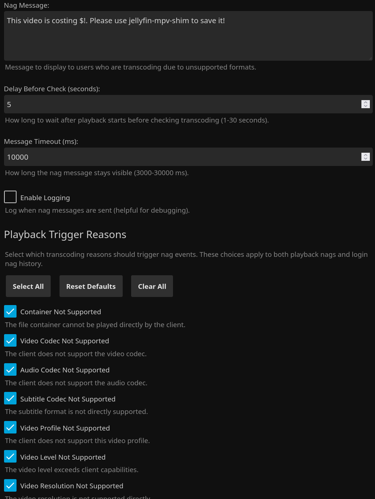
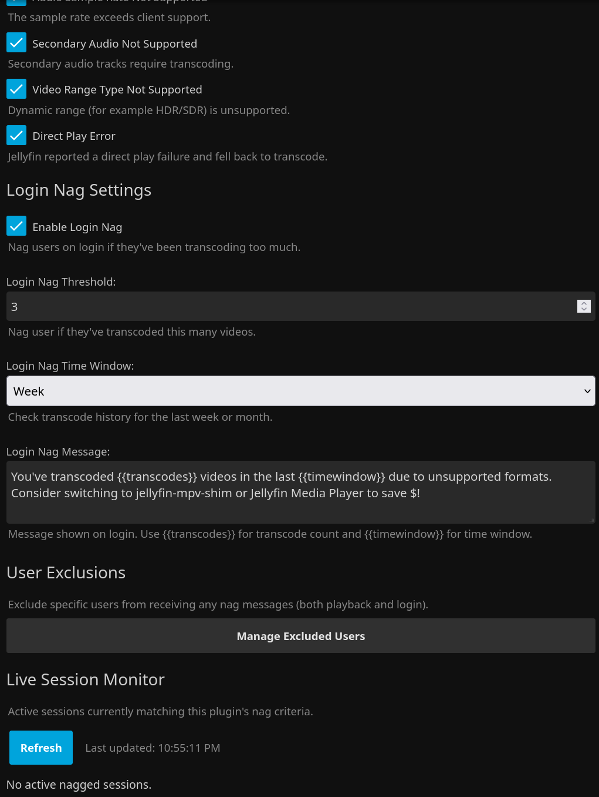

# Jellyfin Transcode Nag Plugin

<p align="center">
  <a href="https://github.com/voc0der/jellyfin-transcode-nag/releases/latest">
    
  </a>
  <a href="https://github.com/voc0der/jellyfin-transcode-nag/tree/main/tests">
    
  </a>
  <a href="https://github.com/voc0der/jellyfin-transcode-nag/issues">
    
  </a>
  <a href="LICENSE">
    
  </a>
  <a href="https://github.com/voc0der/jellyfin-transcode-nag/blob/main/Jellyfin.Plugin.TranscodeNag.csproj">
    
  </a>
</p>

A Jellyfin plugin that intelligently nags users when they're transcoding due to **unsupported formats or codecs**, while allowing bitrate-based transcoding to pass through without harassment.

<p align="center">
  
</p>
<p align="center">
  <em>Playback nag configuration and trigger reason selection</em>
</p>

<p align="center">
  
</p>
<p align="center">
  <em>Login nags, user exclusions, and the live session monitor</em>
</p>

## What It Does

- Sends a playback nag when Jellyfin reports selected `TranscodeReasons`.
- Ignores bitrate-only transcodes, so users lowering quality for bandwidth do not get warned.
- Can send a login nag when a user keeps hitting bad transcodes over the last week or month.
- Lets you exclude users from all nags.
- Includes a live session monitor in the plugin settings page.

## Installation

### Plugin Repository

1. Go to **Dashboard** → **Plugins** → **Repositories**
2. Add `https://raw.githubusercontent.com/voc0der/jellyfin-transcode-nag/main/manifest.json`
3. Install **Transcode Nag** from **Catalog**
4. Restart Jellyfin

### Manual

1. Download the latest ZIP from the [Releases page](https://github.com/voc0der/jellyfin-transcode-nag/releases/latest)
2. Extract it into your Jellyfin plugins directory:
   - Linux: `/var/lib/jellyfin/plugins/`
   - Windows: `%AppData%\Jellyfin\Server\plugins\`
   - Docker: `/config/plugins/`
3. Restart Jellyfin

#### Build from Source

```bash
dotnet build --configuration Release
```

Copy `bin/Release/net8.0/Jellyfin.Plugin.TranscodeNag.dll` into a versioned plugin folder, then restart Jellyfin.

## Configuration

Open **Dashboard** → **Plugins** → **Transcode Nag**.

- Choose which playback transcode reasons should trigger nags. Defaults focus on unsupported container, codec, subtitle, profile, level, resolution, bit depth, framerate, and related compatibility failures.
- Set the playback message, delay, and timeout.
- Optionally add client include/exclude filters using case-insensitive text matching. If the include list is empty, all clients are eligible; exclude matches always win.
- If you want login nags, enable them and set the threshold, time window, and message. The login message supports `{{transcodes}}` and `{{timewindow}}`.
- Use **Manage Excluded Users** to opt users out of both playback and login nags.
- Use the built-in live session monitor to see which active sessions currently match your rules.

## Behavior Notes

- Playback nags happen once per video, not once per session.
- Login nags are rate-limited and use stored history from the last 30 days.
- If a user returns to direct play after a bad transcode, login nags are suppressed until they regress again.

## Star History

<p align="center">
  <a href="https://star-history.com/#voc0der/jellyfin-transcode-nag&Date">
    <picture>
      <source media="(prefers-color-scheme: dark)" srcset="https://api.star-history.com/svg?repos=voc0der/jellyfin-transcode-nag&type=Date&theme=dark" />
      <source media="(prefers-color-scheme: light)" srcset="https://api.star-history.com/svg?repos=voc0der/jellyfin-transcode-nag&type=Date" />
      
    </picture>
  </a>
</p>
